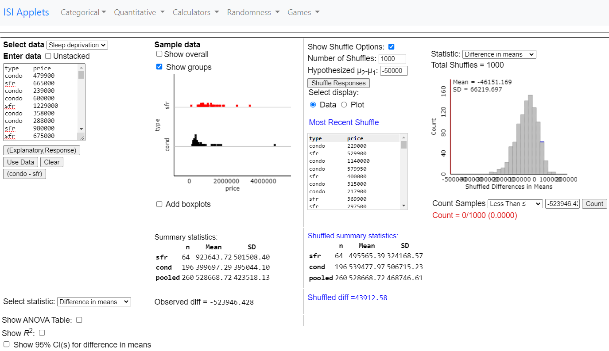
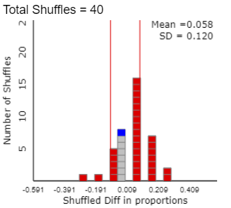

```{r setup, include=FALSE}
knitr::opts_chunk$set(echo = TRUE, include=TRUE) # to turn on solution, use include=TRUE
```

```{r packages and data setup, message=FALSE}
klippy::klippy() # copy and paste code chunks
rm(list = ls()); library(tidyverse); library(janitor)
df = read_csv("https://raw.githubusercontent.com/acammack1234/ma206/main/alexandria.csv")
df = clean_names(df)
df = df %>% rename(url = url_see_https_www_redfin_com_buy_a_home_comparative_market_analysis_for_info_on_pricing)
df = df %>% mutate_if(is.character,as.factor)
```

**I. An article said that, in the long-run, about 60% of houses for sale in Alexandria, VA are condos. You think that it is less than that. You take a random sample of houses for sale in Alexandria.**

**1. What is the observational unit?**

*houses for sale in Alexandria, VA*

**2. What is the symbol for the parameter?**

$\pi$

**3. What is the symbol for the sample statistic?**

$\hat p$

**4. What are the null and alternative hypotheses in symbols and words?**

$H_0: \pi = 0.60$

$H_A: \pi < 0.60$

**5. What is the appropriate theory-based test?**

*One-proportion z-test*

**6. What are the validity conditions for this test? Are they met?**

$\geq 10$ successes and $\geq 10$ failures. Yes.

```{r}
df %>%
  count(property_type) %>%
  mutate(Proportion = n/sum(n)) %>%
  adorn_totals()
```

**7. Give the sample statistic, standardized statistic, and p-value.**

```{r}
phat = 0.56
pi0 = 0.60
n = 350
sd_null = sqrt(pi0*(1-pi0)/n)
z = (phat - pi0)/sd_null  
p_value1 = pnorm(z)
```

$\hat{p}=0.56$\
$z=-1.528$\
$pvalue = 0.0633$

**8. Define p-value.**

*The probability of seeing a statistic as extreme or more extreme than the observed statistic, assuming the null hypothesis is true.*

**9. Interpret the p-value you found, given a 10% significance level.**

*0.0633 \< 0.10 (p-value \<* $\alpha$, so reject $H_0$.) There is moderate evidence that the population proportion of houses for sale that are condos is less than 60%.

**10. Calculate and interpret a 90% confidence interval for the proportion of condos.**

```{r Q2}
se =  sqrt(phat*(1-phat)/n)          #Enter the equation for standard error
mult = qnorm(.95)    #Enter the equation for calculating your multiplier
CI = c(phat - mult*se, phat + mult*se)
CI
```

This is the plausible range of values for the overall proportion of condos out of all houses for sale in Alexandria, VA. \newpage

**II. Another article says that, on average, condos are \$50K cheaper than single family homes in Alexandria.**

**1. What are the variables? Categorical or quantitative?**

*property type (categorical)*\
*price (quantitative)*

**2. Is this an observational study or experiment?**

*An observational study. We are not using random assignment.*

**3. What is the symbol for the parameter?**

$\mu_s - \mu_c$\
s = single family homes, c = condos

**4. What is the symbol for the sample statistic?**

$\bar{x}_s - \bar{x}_c$

**5. What are the null and alternative hypotheses in symbols and words?**

$H_0: \mu_s - \mu_c = 50000$ *On average, single family homes are \$50,000 more than condos.*\
$H_A: \mu_s - \mu_c > 50000$ *On average, single family homes are over \$50,000 more expensive than condos.*

**6. What is the appropriate theory-based test?**

*two-sample t-test*

**7. What are the validity conditions for this test? Are they met?**

$\geq20$ observations in each group, and neither group is strongly skewed. No, single family homes are slightly skewed, but condos are strongly skewed to the right.

\
\
**Simulation would be a better approach in this case, but we will proceed with the theory-based method, understanding that we should be skeptical of our results.**

```{r}
df %>%
  filter(property_type %in% c("Single Family Residential", "Condo/Co-op")) %>% 
  ggplot(aes(x=price)) + 
  geom_histogram() +
  geom_boxplot() +
  facet_grid(property_type ~.)

df %>%
  filter(property_type %in% c("Single Family Residential", "Condo/Co-op")) %>%
  group_by(property_type) %>%
  summarise(xbar = mean(price),
            s = sd(price),
            n = n())
```

**8. Give the sample statistic, standardized statistic, and p-value.**

```{r}
xbar_s = 923644
xbar_c = 399697
s_s = 501508
s_c = 395044
n_s = 64
n_c = 196
sd = sqrt(s_s^2/n_s+s_c^2/n_c)
null = 50000
statistic = xbar_s-xbar_c
t = (statistic-null)/sd

n = n_s+n_c
pvalue2 = 1 - pt(t,n-2)
```

$\bar{x}_s - \bar{x}_c = \$523,947$\
$t = 6.894$\
$p-value = 2.076*10^{-11}$

**9. Interpret the p-value you found, given a 5% significance level.**

The p-value of 2.076e-11 is less than the significance level of 0.05, so we reject the null hypothesis. We have very strong evidence that condos are more than \$50,000 cheaper than single family homes, on average.

**10. Calculate the 95% confidence interval.**

```{r}
mult = qt(.975,n-2)
se = sd
CI = c(statistic - mult*se, statistic + mult*se)
CI 
```

in dollars.

**11. Calculate the margin of error.**

```{r}
margin_of_error = mult*se
margin_of_error
```

in dollars.

\newpage

**III. You are interested in if townhouses make up the same proportion of the housing market in Alexandria vs. Arlington.**

**1. What are the variables? Categorical or quantitative?**

*property type, categorical*\
*city, categorical*

**2. What is the symbol for the parameter?**

$\pi_{alx}-\pi_{arl}$

**3. What is the symbol for the sample statistic?**

$\hat{p}_{alx}-\hat{p}_{arl}$

**4. What are the null and alternative hypotheses in symbols and words?**

$H_0:\pi_{alx}-\pi_{arl}=0$ The population proportion of condos is the same in Alexandria and Arlington.\
$H_A:\pi_{alx}-\pi_{arl}\neq0$ The population proportion of condos is different between Alexandria and Arlington.

**5. What is the appropriate theory-based test?**

*two-sample z-test*

**6. What are the validity conditions for this test? Are they met?**

$\geq10$ observations in each cell of the two-way table. Yes

```{r Q3}
df %>%
  filter(city %in% c("Alexandria","Arlington")) %>% 
  count(city, property_type) %>%
  pivot_wider(names_from = city, values_from = n) %>%
  adorn_totals(c("row", "col"))

df %>%
  filter(city %in% c("Alexandria","Arlington")) %>% 
  ggplot(aes(x= city, fill = property_type)) +
  geom_bar(position = position_fill())
```

**Here are the results from a simulation:**



**7. Give the p-value from simulation.**

$p-value=32/40=0.8$ *This is the proportion of trials that produce a simulated statistic as extreme or more extreme than the observed statistic.*

\newpage

**IV. Interpreting the results of a multiple linear regression model**

```{r, include=TRUE}
lm1 = lm(price ~ city*square_feet, data = df)
summary(lm1)
```

**Hint: The city of Alexandria is included in the base model.**

**1. What is the price per sqft in Alexandria?**

*\$406.67/sf*

**2. What is the price per sqft in Arlington?**

*(\$406.67 - \$124.46) = \$282.21/sf*

**3. Which output tells us the proportion of the variation in price explained by the model?**

$R^2$

**4. After adjusting for square_feet, does the city have a statistically significant affect on price? How do you know?**

*No, none of the interaction terms for city:square_feet are statistically significant.*

\newpage

**V. The West Point basketball team is interested in whether listening to music during practice increases a player's 3-point percentage during games.**

**1. Draw the causal diagram for this situation.**

*listened to music $\rightarrow$ 3-point percentage*

**2. What is the appropriate theory-based test?**

*two-sample t-test* 

**3. How would the study need to be designed to determine a cause-and-effect relationship?**

*Players would have to be randomly assigned to the music group and no-music group.*

**4. Could the results be generalized beyond the West Point basketball team? Why or why not?**

*No, a convenience sample was used.  To generalize the results to a larger population, a random sample would have to be taken from that population.*
*Note: Sample size does not prevent us from generalizing.  Smaller sample sizes are accounted for with a wider null distribution (and also a wider confidence interval).*

**VI. The Superintendent is trying to assess the level of morale within the Corps. He asks all the cadets that he randomly walks by about their morale. What type of sample is this?**

*A convenience sample. A simple random sample requires a random selection from a sampling frame.*

**VII. (TRUE/FALSE) A p-value is the probability that the null hypothesis is true.**

*FALSE. A p-value is the probability of observing a result as extreme or more extreme than the observed statistic, assuming the null hypothesis is true.*

**VIII. (TRUE/FALSE) If random samples are repeatedly taken from the same population, and for each sample a confidence interval is generated at the 95% confidence level, then over the long-run, 95% of the confidence intervals will contain the true population parameter.**

*TRUE.  We also interpret a 95% confidence interval as:*\ 
"We are 95% confident that the population parameter is in our confidence interval."\
*Confidence intervals give us the range of plausible values for the population parameter.*

\newpage

**1% of people are in the NBA. NBA Players have a 95% chance of being over 6' tall. 81% of people not in the NBA are not over 6'.**

*A = person is over 6' tall*\
*B = person is in the NBA*

**1.  Write in probability notation: the probability that a randomly selected person is over 6' given that they are in the NBA.**

$P(A|B)$

**2.  What is the probability that a randomly selected person is over 6' tall?**

**Given:**\
$P(B)=0.01$\
$P(A|B)=0.95$\
$P(A'|B')=0.81$

**Solution:**\
$P(A) = P(A \cap B) + P(A \cap B')$\
$P(A \cap B) = P(A|B)*P(B) = 0.95*0.01 = .0095$\ 
$P(A|B') = 1 - P(A'|B') = 1 - 0.81 = 0.19$\
$P(B') = 1 - P(B) = 1 - 0.01 = 0.99$\
$P(A \cap B') = P(A|B')*P(B') = 0.19*0.99 = 0.1881$\
$P(A) = P(A \cap B) + P(A \cap B') = 0.0095 + 0.1881 = \underline{\underline{0.1976}}$

```{r, include=FALSE}
.95*.01
1-.81
1-.01
.19*.99
0.0095 + 0.1881
```

**3.  Given that a person is over 6' tall, what is the probability that they are in the NBA?**

$P(B|A) = \dfrac{P(A \cap B)}{P(A)} = \dfrac{0.0095}{0.1976}= 0.0481$

*or use Bayes to flip the direction of a known conditional probability:*

$P(B|A) = \dfrac{P(A|B)*P(B)}{P(A)} = \dfrac{0.95*0.01}{0.1976} = 0.0481$

```{r, include=FALSE}
.0095/.1976
.95*.01/.1976
```

